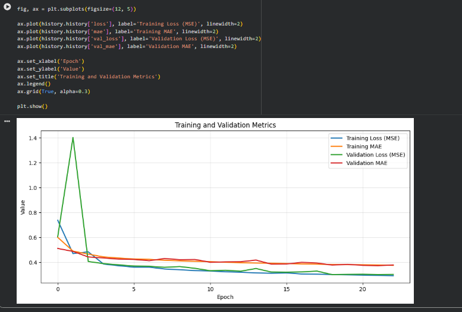
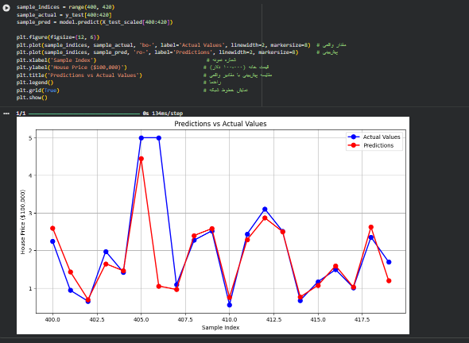
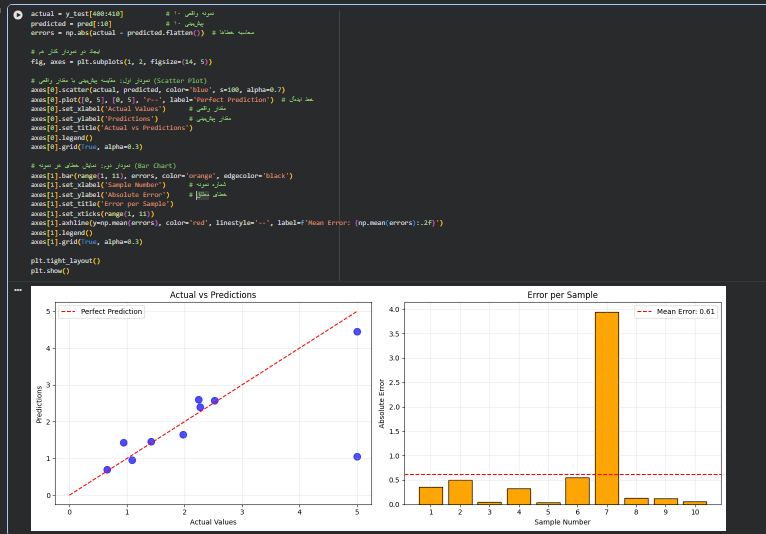

# پیش‌بینی قیمت مسکن کالیفرنیا با TensorFlow و Keras

یک پروژه یادگیری عمیق با استفاده از TensorFlow و Keras برای پیش‌بینی قیمت مسکن در ایالت کالیفرنیا با استفاده از دیتاست California Housing.

## معرفی پروژه

در این پروژه یک مدل شبکه عصبی رگرسیونی ساخته شده است که با استفاده از ویژگی‌های مختلف مانند درآمد متوسط، تعداد اتاق‌ها، موقعیت جغرافیایی و... قیمت مسکن را پیش‌بینی می‌کند.

## تکنولوژی‌های استفاده شده

* Python
* TensorFlow
* Keras
* Scikit-learn
* NumPy
* Matplotlib

## معماری مدل

مدل ساخته شده شامل لایه‌های زیر است:

* لایه ورودی با ۸ ویژگی (MedInc, HouseAge, AveRooms, AveBedrms, Population, AveOccup, Latitude, Longitude)
* لایه Dense با ۱۲۸ نرون و تابع فعال‌سازی ReLU
* لایه Dense با ۶۴ نرون و تابع فعال‌سازی ReLU
* لایه خروجی Dense با ۱ نرون برای پیش‌بینی قیمت (رگرسیون)

## دیتاست

دیتاست مورد استفاده، California Housing است که شامل اطلاعات مربوط به بلوک‌های مسکونی در کالیفرنیا می‌باشد:

* ۲۰,۶۴۰ نمونه داده
* ۸ ویژگی ورودی
* هدف: پیش‌بینی قیمت متوسط خانه

## پیش‌پردازش داده‌ها

* استانداردسازی داده‌ها با استفاده از StandardScaler
* تقسیم داده‌ها به سه بخش Train, Validation, Test

## آموزش مدل

تنظیمات آموزش مدل:

* بهینه‌ساز (Optimizer): SGD
* تابع خطا (Loss Function): MSE
* متریک‌ها: MAE
* استفاده از EarlyStopping برای جلوگیری از بیش‌برازش (Overfitting)

## نتایج آموزش مدل 

نمودار زیر روند تغییر Loss و MAE مدل را در طول آموزش نشان می‌دهد:

## نمودار مقایسه پیشبینی با مقادیر واقعی

## نمودار تحلیل خطا 

