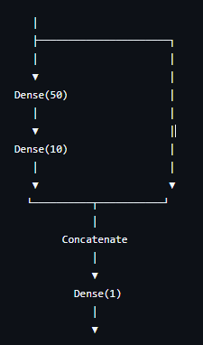
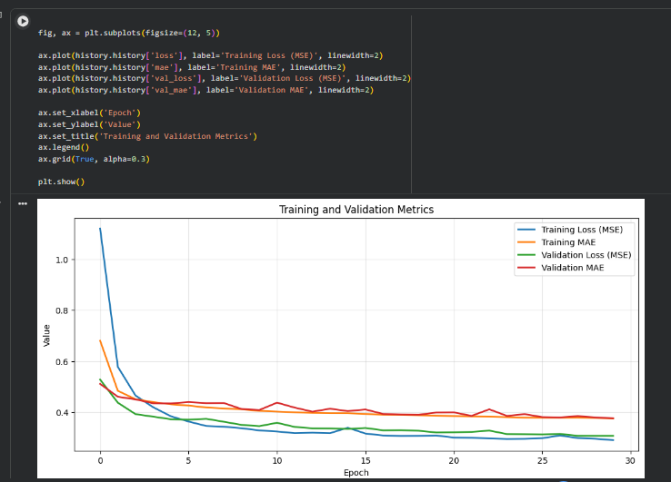
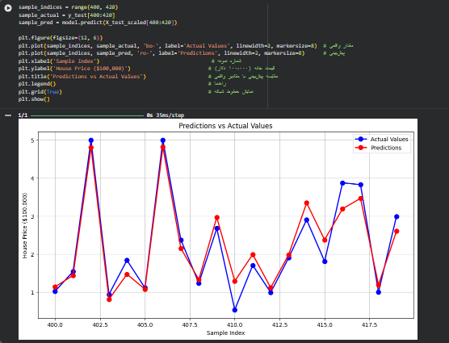
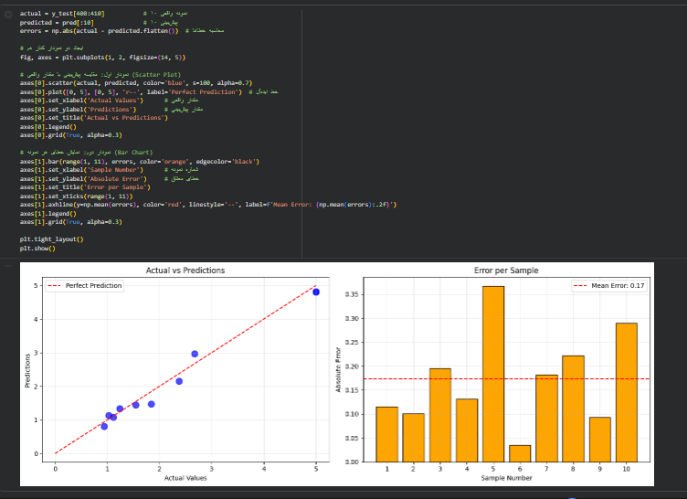

# پیش‌بینی قیمت مسکن کالیفرنیا با Functional API و دو ورودی

یک پروژه یادگیری عمیق با استفاده از TensorFlow و Keras و معماری Functional API برای پیش‌بینی قیمت مسکن در ایالت کالیفرنیا با استفاده از دیتاست California Housing.

## معرفی پروژه

در این پروژه یک مدل شبکه عصبی با معماری **Functional API** و **دو ورودی** ساخته شده است. یک ورودی شامل ۸ ویژگی اصلی است و ورودی دوم شامل ۴ ویژگی انتخاب‌شده است که پس از عبور از لایه‌های مخفی، با ورودی اصلی ترکیب (Concatenate) می‌شود.

## تکنولوژی‌های استفاده شده

* Python
* TensorFlow
* Keras (Functional API)
* Scikit-learn
* NumPy
* Matplotlib

## معماری مدل

مدل ساخته شده با استفاده از **Functional API** شامل لایه‌های زیر است:

* **ورودی:** ۸ ویژگی (MedInc, HouseAge, AveRooms, AveBedrms, Population, AveOccup, Latitude, Longitude)
* **لایه پنهان اول:** Dense با ۵۰ نرون و تابع فعال‌سازی ReLU
* **لایه پنهان دوم:** Dense با ۱۰ نرون و تابع فعال‌سازی ReLU
* **Concatenate:** ترکیب ورودی اصلی با خروجی لایه پنهان دوم
* **لایه خروجی:** Dense با ۱ نرون (پیش‌بینی قیمت - رگرسیون)

## دیتاست

دیتاست مورد استفاده، California Housing است که شامل اطلاعات مربوط به بلوک‌های مسکونی در کالیفرنیا می‌باشد:

* ۲۰,۶۴۰ نمونه داده
* ۸ ویژگی ورودی
* هدف: پیش‌بینی قیمت متوسط خانه

## پیش‌پردازش داده‌ها

* استانداردسازی داده‌ها با استفاده از StandardScaler
* تقسیم داده‌ها به سه بخش Train, Validation, Test

## آموزش مدل

تنظیمات آموزش مدل:

* بهینه‌ساز (Optimizer): Adam
* تابع خطا (Loss Function): MSE
* متریک‌ها: MAE
* استفاده از EarlyStopping برای جلوگیری از بیش‌برازش (Overfitting)

## نتایج آموزش مدل 

نمودار زیر روند تغییر Loss و MAE مدل را در طول آموزش نشان می‌دهد:

## نمودار مقایسه پیشبینی با مقادیر واقعی

## نمودار تحلیل خطا 

